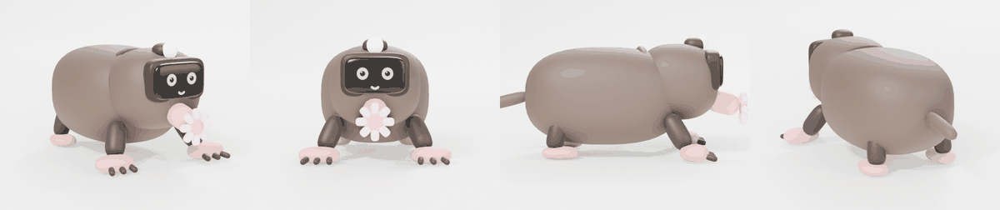

# Creatures

Hoot the owl can turn his head right round to see who's behind him. Lag the sloth is
always low on battery, so when you poke him the poke reaches him a second later. Link the
dachshund is too long to turn round in one go and does it in three. Earl, who is a
teapot, pours tea for whoever is standing nearest and then bows.

They are 149 toy robots, and they live in a box drawn round your web page. They walk
in along the floor, come up through it, fly down from the ceiling and climb the walls. They
play fetch and hide and seek, knock down each other's towers of blocks, nap in a heap, and
keep an eye on your mouse. None of it is a recorded animation. Every joint is on a spring,
and each creature decides, frame by frame, where its joints would like to be.

**[Meet them in the playground](https://wisdomousai.github.io/creatures/)**

## Put them on your page

```sh
npm install @wisdomousai/creatures three
```

They need a canvas, a layer for their hit areas, and your page in between the box and
the crew:

```html
<main>Your page</main>
<canvas id="crew"></canvas>
<div id="hits"></div>
```

```css
#crew,
#hits {
  position: fixed;
  inset: 0;
  width: 100%;
  height: 100%;
  pointer-events: none;
  z-index: 1;
}
#hits {
  z-index: 2;
}
main {
  position: relative;
  z-index: 1;
}
:root {
  --bot: 96px; /* how big they are */
}
```

```ts
import { Crew, MODELS } from '@wisdomousai/creatures';

const crew = new Crew({
  canvas: document.querySelector<HTMLCanvasElement>('#crew')!,
  hits: document.querySelector<HTMLElement>('#hits')!,
  models: MODELS,
});
crew.box?.el.after(document.querySelector('main')!); // the box goes behind your page
crew.start();
```

Then wait. Before long someone turns up, potters about for a minute or so and goes home.
Poke one and it jumps; poke it three times quickly and it gets dizzy; rest the mouse on it
and it goes soppy. Hold one down and it follows the pointer, flying if it can.

`MODELS` fetches this version's models from jsDelivr. To serve them yourself, copy
`node_modules/@wisdomousai/creatures/models` into your public folder and pass
`models: '/creatures/'`, trailing slash and all.

### Only some of them

The models come to 46 MB, and a page rarely wants a hundred and fifty robots. Take the ones
you like:

```sh
npx @wisdomousai/creatures add owl fox
```

Hoot and the fox go into `public/creatures/`, with the textures they share, about 3 MB in
all. When it's done it tells you what to put in `Crew`. You can ask by name as well as by
key, so `add hoot` gets the owl, and `creatures list` says who's in the box.

| Option          | What it does                                                          |
| --------------- | --------------------------------------------------------------------- |
| `--to <folder>` | Puts them there instead (`public/creatures`, or `./creatures`).       |
| `--scenery`     | Brings the furniture, the props and the hangings too.                 |
| `--bare`        | Leaves the shared textures and pictures behind.                       |
| `--all`         | The whole box.                                                        |

Give `roster` the same names (`roster: ['owl', 'fox']`) or the crew will send for the others
and find nobody home.

## Some things to ask of them

```ts
crew.call('owl'); // Hoot, now
crew.members.get('owl')?.perform('roundAndBack'); // the head, right round and back
crew.call('teapot');
crew.members.get('teapot')?.perform('bow');
crew.look = 'colour'; // everyone in their own colours (or 'ink', 'paper')
crew.max = 8; // a crowd
crew.page('creatures/dogs'); // the dogs' room: a kennel, a stool, a pendant lamp
crew.dismiss(); // everyone home
```

Everyone has tricks of their own, and `crew.members.get('owl')?.repertoire` lists Hoot's.
The rest of the options and methods are in [the reference](docs/reference.md).

## Hand them a sign

```ts
const hold = crew.holdUp('cat', 'sign', {
  label: 'Contact',
  onPick: () => location.assign('/contact'),
});
if (hold) hold.label = 'Say hello'; // the lettering is repainted
await hold?.lead('right'); // and off they walk with it, out of the page
```

Any of them will hold up a sign, and nobody is told how. The grip is found on the model:
the creature class says which end of the body does the holding (a robot's palms, a dog's
jaw, an owl's talons) and the sign is placed by looking for that spot on the skin, so a new
creature gets it for free. Then the sign is picked for the body. Anyone who can hold things
overhead gets a picket on a stick, an owl hovers and hangs a board from its feet, someone
with no grip at all gets an easel on the floor beside them, and the small ones get a card.
Ask for a kind by name (`'placard'`, `'picket'`, `'hanger'`, `'arrow'`, `'paddle'`, `'easel'`,
`'banner'`, `'card'`, `'tag'`) and they will if they can; `crew.canHold(who, tool)` says.

The lettering is painted on a canvas, fitted to the board by trying text sizes until the
words just fit, and laid on the board's paper. It uses your font (`font: 'Georgia'`, a CSS
font family), looks sharp on a dense screen, and is repainted for each look. With
`onPick` there is a real `<button>` over the board, so it can be tabbed to, read out
and pressed with Enter or Space as well as clicked, and it wiggles when it's hovered or focused. Take it
away with `hold.release()`.

There's more than signs. `crew.holdUp('owl', 'telescope')` (also a map, a lantern, a
magnifier, a flag that ripples, an umbrella, a balloon on a string and a megaphone) holds
it the same way. A creature's card lists the ones it was made to carry (`CARDS.owl.tools`).

## Make one of your own

A creature is two files that agree on some names. A Python script builds the body in
Blender out of rounded shapes, gives it a skeleton and names every part. A TypeScript class
gives it a life: what it likes doing, how springy each joint is, and what its lights do
when it's happy. The model carries no animation at all, and the class has never heard of a
keyframe.



Digby here is a star-nosed mole with a miner's lamp, made to show how it's done. He isn't
in the crew, so he's yours to copy. [How a creature is made](docs/how-they-are-made.md)
follows him from his first shape to his first dig, and his files are in
[`skills/make-a-creature/example`](skills/make-a-creature/example).

Or have your coding agent do it:

```sh
npx @wisdomousai/creatures skill
```

The skill lands in `.claude/skills/`. Add `--global` for `~/.claude/skills`, or `--to` for
another agent's folder. `npx skills add wisdomousai/creatures` does the same from GitHub.

and ask it for a robot armadillo that rolls into a ball.

## Working on the crew

```sh
npm install
npm run dev     # the playground, on the source; `crew` is in the console
npm run check   # types
npm run build   # the package
```

The models are rebuilt from `blender/`, which has [its own notes](blender/README.md).

## Licence

MIT, for all of it: the code, the models, the portraits and the Blender scripts.
