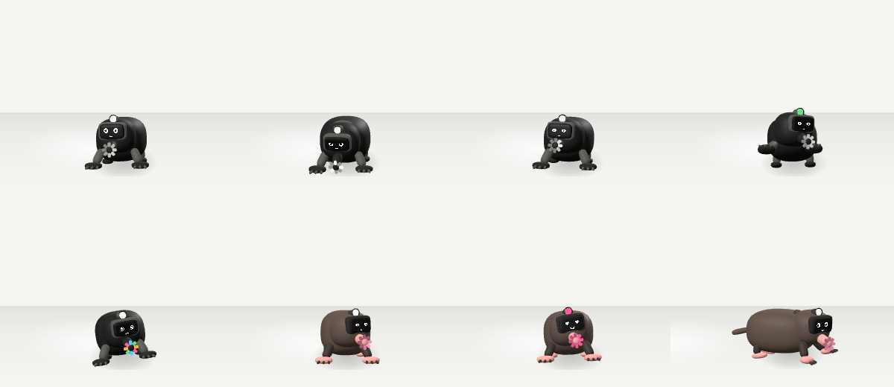

# How a creature is made

Every creature is two files that agree on some names. Digby, a robot star-nosed mole, is
the one followed here. He was made for this page and isn't in the crew, and both his files
are in [`skills/make-a-creature/example`](../skills/make-a-creature/example): `mole.py`
builds his body in Blender and `mole.ts` gives him his life.



## The body

Nobody sculpted Digby. A Python script places every part by numbers, so a creature can be
rebuilt, tweaked and rebuilt again in a few seconds, and the whole crew can be regenerated
when something shared changes.

### Shapes

Almost everything is a superellipsoid: one formula with two exponents that makes a sphere
when they're 1, a rounded box when they're smaller, and something like a pebble or a
cushion in between. His body is a single call:

```python
seakit.pod('Body', (0, 0.03, 0.085), (0.08, 0.115, 0.07), (0.75, 0.85))
```

That's a name, a centre, three radii and the two exponents. The units are real metres:
Digby is 19 cm tall, faces −Y (towards you) and stands on z = 0, like everyone else in the
crew. `kit.py` has the rest of the toolbox: tubes swept along a curve, lathed shapes, tori,
cuts, and the screen that becomes a face.

### Bones

His skeleton is a list of bones, each a name, a head, a tail and a parent:

```python
('nose', (0, -0.12, 0.078), tuple(STAR), 'head'),
```

Each part is then bound to one bone and moves with it rigidly. That's why the crew move
like toys with joints rather than like rubber: the snout is one piece, the nose bone turns
it, and the eight nubs of his star go along for the ride. (A tail or a stem can be handed
along a chain of bones instead, so it bends.)

The bone names are the first half of the agreement between the two files. The TypeScript
side never sees a vertex; it says "nose, 10 degrees" and trusts that there's a nose.

### Paint

The browser makes its own materials, so a model's materials only travel as names, and the
names are the second half of the agreement:

| Name                   | What the browser does with it                                          |
| ---------------------- | ---------------------------------------------------------------------- |
| `Shell`                | the body colour                                                        |
| `Joint`, `Bezel`       | the darker parts: knuckles, collars, the rim round the screen          |
| `Screen`               | the glass the face is drawn on                                         |
| `Beacon`               | a light whose colour shows how it feels                                |
| `Dot0`, `Dot1`, …      | lights it can dim, brighten and recolour one by one                    |
| `Shell_Paw`, `Shell_…` | a part that looks like the shell, except in colour, where it's its own |

There are three looks. Ink is a small dark robot with a white face; paper is paper-white,
drawn round in ink lines; colour is the creature's own palette. Digby's palette makes him
velvet brown with pink paws and a pink star:

```python
{'base': {'shell': '#5d4d45', 'joint': '#3b312c', 'bezel': '#2b2421'},
 'roles': {'Paw': '#f3a6a0', 'Snout': '#f3a6a0'},
 'dots': ['#7a3f45', '#ff9ec4']}  # a dot's colour off, then on
```

### The face

In the model the screen is blank glass. The face is drawn live in the browser, glowing lines
on black on a little canvas, from a layout that says where the eyes sit, how big they are and
how thick the line is, all as fractions of the screen. The same numbers sit in the Blender
script so the previews match. There are fourteen expressions: neutral, happy, surprised,
love, wink, sleepy, asleep, dizzy, focused, sad, cross, starry, sheepish and determined.

### Out of Blender

```sh
blender/build.sh mole
```

That's one skinned mesh and a skeleton in a `.glb`: no animation clips, no textures,
squeezed with meshopt. Digby comes out at 150 KB; the crew try to stay under 250.


## The life

### Springs

Every joint is a weight on a spring, chasing a target. The code only ever moves targets,
and the springs supply everything that makes it look alive: the easing in, the overshoot,
the little settle at the end. (The idea is t3ssel8r's, from "Giving personality to
procedural animations".) Each spring has three numbers:

- `f`, in Hz: how quickly it gets there.
- `zeta`: how much it wobbles. At 0 it wobbles for ever; at 1 it arrives without
  overshooting.
- `r`: how it sets off. At 0 it eases in; above 1 it overshoots; below 0 it winds up the
  wrong way first, like a cartoon about to run.

Digby's are set per bone, and they're most of his personality:

```ts
feels: {
  default: { f: 4, zeta: 0.5 },
  root: { f: 2.5, zeta: 0.6 },
  body: { f: 3, zeta: 0.5, r: 0.5 },
  head: { f: 3.5, zeta: 0.45 },
  nose: { f: 7, zeta: 0.3 }, // twitchy
  tail: { f: 5, zeta: 0.25 }, // floppy
},
```

Because nothing is animated directly, nothing ever snaps. Poke him halfway through a dig
and his paws don't jump to the flinch: they swing over, overshoot a little and settle, and
nobody wrote any code for the in-between.

### A frame

Every frame each creature runs the same few steps:

1. `idle(t)`, always on and underneath everything: breathing, a sniff now and then.
2. `pose(dt, env)`: targets for whatever it's doing now.
3. The gaze turns the bones listed in `gaze` toward the mouse: the eyes first, then the head
   and body after a beat (`lag`, in Hz), never further than `reach`.
4. The springs move.
5. `after(dt, env)`: the lights, and any turn too fast for a spring to follow, like a
   wingbeat or a spin.

Targets add up, so layers stack without knowing about each other. While Digby digs, his
head gets breathing from `idle`, a nod into the dirt from `pose`, and a glance at your
mouse from the gaze, all at once:

```ts
p.add('head', 18 * k); // pitch, yaw, roll in degrees, on top of whatever's there
```

### Acts

What he does is a table of acts, and when one runs out he rolls weighted dice for the
next:

```ts
idle: { weight: 3, length: [3, 6] },
stroll: { weight: 3, length: [5, 8], when: still, start: () => this.walkTo(…) },
dig: { weight: 1.4, length: [3.5, 5], face: 'determined', when: still },
sniff: { weight: 1.2, length: [3, 4.5], face: 'focused', when: still },
lookout: { weight: 1, length: [4, 5.5], when: still },
poked: { weight: 0, length: [2.5, 3] },
love: { weight: 0, length: [4, 5], face: 'love' },
dizzy: { weight: 0, length: [4, 4.5], face: 'dizzy' },
```

`length` is in seconds, picked between the two. `when` keeps an act for the right moment
(no digging mid-stroll). An act with weight 0 never comes up by chance; it waits for
something to happen to him. `pose()` reads `this.act` and `this.actT`, the seconds since it
began, and eases in and out of each one so that nothing starts with a jolt:

```ts
const k = ease(Math.min(t / 0.5, left / 0.5));
```

### Pokes

The crew keep the same house rules: a poke startles, three quick pokes make them dizzy,
and a mouse resting on them makes them happy. How each one shows it is up to them. Lag the
sloth gets the poke a second late, the knight hides behind his shield, and Digby flinches,
hops and goes cross:

```ts
poke() {
  const now = performance.now() / 1000;
  this.pokes = [...this.pokes.filter((at) => now - at < 3), now];
  if (this.pokes.length >= 3) {
    this.pokes = [];
    this.setAct('dizzy');
  } else if (this.act !== 'dizzy') {
    this.puppet.kick('body', -60); // a knock to the spring, not a pose
    this.hopUp(0.2);
    this.setAct('poked');
  }
}
```

### Getting about

The box round the page has a floor, a ceiling and two walls, and `edges` says which of
them a creature lives on; Mica the starfish lists the floor three times and each wall once,
so she's mostly on the floor and sometimes up a wall. `entrance` is how it arrives: Digby
uses `'rise'` and comes up through the floor, walkers walk in from the side and fliers fly.
`stay` is how long it hangs about before it goes home.

To go somewhere it calls `walkTo(s)`, and the crew move it there, round the others and in
and out of the depth of the box. The legs are its own business: `this.gait` turns over as it
walks and `this.stride` says how fast. Digby's four legs share one helper, which swings them
in diagonal pairs:

```ts
trot(p, this.gait, clamp(this.stride / ((this.spec.speed ?? 1) * env.frame.bot), 0, 1.5));
```

### Lights

`after()` runs once the springs have moved, and it's where the lights go.
`this.outfit.dot(i, level, colour)` sets one of the dots, and `this.outfit.beacon(colour)`
sets the beacon. Sniffing, Digby runs a light round his star:

```ts
level = Math.max(0.2, Math.cos(time * 9 - (i / NUBS) * 2 * Math.PI));
```

His lamp takes the colour for how he feels from `BEACON`: green when he's focused, pink
when he's soppy. In dizzy, every nub cycles through `RAINBOW`.

### Slow machines

A frame's time step is capped at 1/20 s, so a stalled tab never fires a creature across
the room. Anything that gets kicked and has to ring true at any frame rate (a bell, a fin, a
pendulum) uses `FixedSpring`, which steps at 120 Hz however fast or slow the frames come.

## The house rules

- Every one is a robot: a toy robot's take on the animal, not the animal in a robot suit.
  Joints show and faces are screens.
- The colour is in the lights, in a part that's its signature: Digby's star, the
  octopus's suckers, the dachshund's back.
- The eyes follow the mouse, then the head and body after a beat, but nobody walks toward
  it.
- A poke startles, three quick pokes make them dizzy, and a mouse resting on them makes them
  happy.

## Bring him on

On your own page, a creature is a line in `ROSTER` (and, for the colour look, a palette):

```ts
import { Crew, MODELS, PALETTES, ROSTER } from '@wisdomousai/creatures';
import { Mole, MOLE_PALETTE } from './mole';

ROSTER.mole = { file: '/models/mole.glb', make: (model) => new Mole(model), weight: 3 };
PALETTES.mole = MOLE_PALETTE;

const crew = new Crew({ canvas, hits, models: MODELS });
crew.call('mole');
```

`file` can be a whole address; the crew's own models still come from `models`.

## Your turn

Copy Digby and change him into something else. The steps, and the mistakes worth not
making, are in [the make-a-creature skill](../skills/make-a-creature/SKILL.md). It's written
for a coding agent, but people can read it too.
